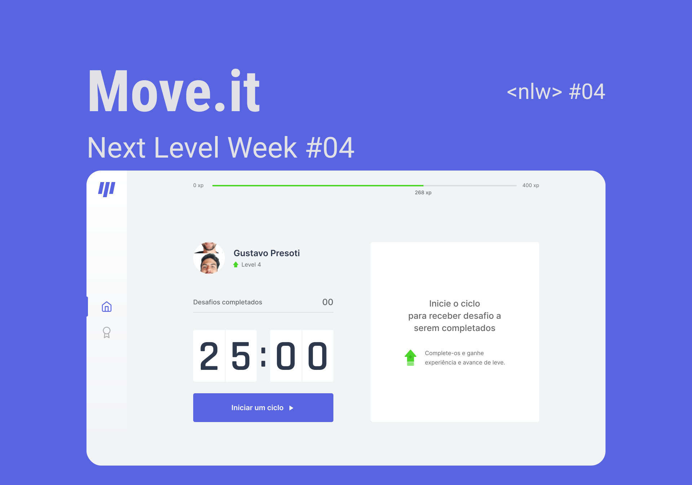

<h1 align="center">
    
</h1>

  <a href="#-tecnologias">Tecnologias</a>&nbsp;&nbsp;&nbsp;|&nbsp;&nbsp;&nbsp;
  <a href="#-projeto">Projeto</a>&nbsp;&nbsp;&nbsp;|&nbsp;&nbsp;&nbsp;
  <a href="#-layout">Layout</a>&nbsp;&nbsp;&nbsp;|&nbsp;&nbsp;&nbsp;
  <a href="#memo-licença">Licença</a>

 

  

 

  

## 🚀 Tecnologias

Esse projeto foi desenvolvido com as seguintes tecnologias:

- [React](https://reactjs.org/)
- [TypeScript](https://www.typescriptlang.org/)
- [Next.js](https://nextjs.org/)

## 💻 Projeto

O Move.it é uma aplicação que estimula as pessoas a fazerem intervalos para descanso durante suas atividades e praticarem exercícios simples, aplicando a técnica Pomodoro. 🧘🏾‍♀️🏃🏾

## 🔖 Layout

Você pode visualizar o layout do projeto através desse [link](https://www.figma.com/file/ge20pu3ofMOKoliUyKx1Nl/Move.it-1.0). Lembrando que você precisa ter uma conta no Figma para acessá-lo.

## 📝 Licença

Esse projeto está sob a licença MIT. Veja o arquivo [LICENSE](LICENSE.md) para mais detalhes.

---

Projeto idealizado by Rocketseat ([Participe da comunidade!](https://discordapp.com/invite/gCRAFhc))
